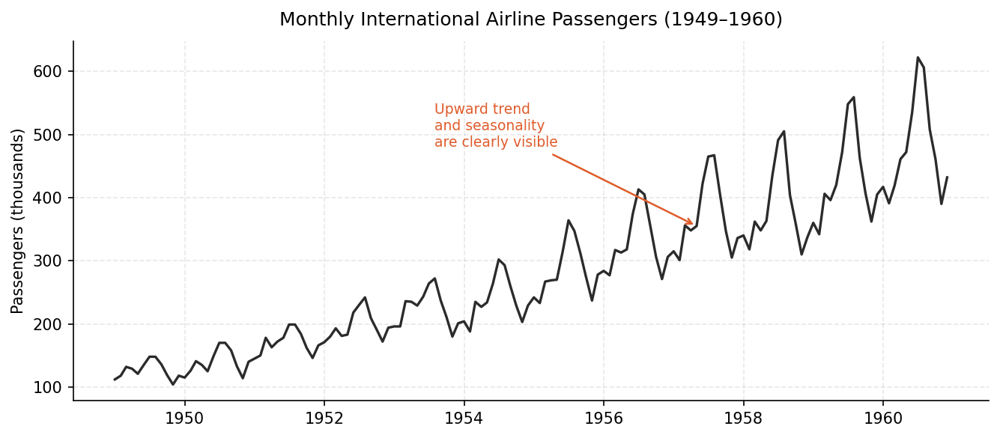

# What Does It Mean to Model a Time Series?

*Before learning which model to use, it helps to understand what a model actually is.*

---

## The World Is Complicated

The world is complicated — and we can try to interpret reality in many ways.

One approach is to take a slice of reality and represent it through a set of assumptions expressed in the language of mathematics. Think about it: if we want to understand how the average daily temperature of a city evolves, we can suppose that today's temperature shouldn't differ dramatically from yesterday's. Nearby days should carry information about the next day. But we also know that average temperatures shift with the seasons, so to predict tomorrow's temperature well, it's also informative to look at what temperatures looked like at this time *last year*. That means we might need to reach back at least 12 months into the past.

This kind of reasoning — laying down assumptions, translating them into equations, then checking if they were reasonable — is exactly what modelling is.

This article is about the foundations. Not *which* model you should use, but *what a model is*, *why the random error term matters more than people give it credit for*, and *how to tell if the model you chose was a good idea*. By the end, you'll be able to look at a model equation and understand what every piece of it is doing.

Let's dive in 🚀

---

## What Is a Time Series?

Let me give you two answers — one intuitive, one slightly more precise.

**Intuitively**, a time series is a numerical measurement (temperature, price, number of passengers, electricity demand…) recorded at regular time intervals (every minute, every hour, every month…) that tends to exhibit some degree of randomness.

**More precisely**, a time series is one realisation of a discrete-time stochastic process with a continuous state space. If that sounds like a mouthful, don't worry — the intuitive definition will carry us through this article. The formal version just says that the sequence of values you observe is one possible outcome drawn from a random process that unfolds in time.

One of the most iconic examples is the **AirPassengers** series: monthly counts of international airline passengers from 1949 to 1960. It shows up in practically every introductory time series course, and for good reason — it is simple, clean, and has two features that make it interesting: an upward trend and a repeating seasonal pattern.

```python
import pandas as pd
import matplotlib.pyplot as plt
import matplotlib.dates as mdates

df = pd.read_csv("data/airline.csv", parse_dates=["date"])
df = df.sort_values("date").reset_index(drop=True)

fig, ax = plt.subplots(figsize=(9, 4))
ax.plot(df["date"], df["passengers"], color="#2B2B2B", linewidth=1.6)
ax.set_title("Monthly International Airline Passengers (1949–1960)")
ax.set_ylabel("Passengers (thousands)")
ax.xaxis.set_major_formatter(mdates.DateFormatter("%Y"))
plt.tight_layout()
plt.show()
```


*Figure 1: Monthly international airline passengers. The upward trend and seasonal swings are impossible to miss.*

We'll come back to this series throughout the article.

---

## What Does It Mean to Model a Time Series?

Modelling a time series means finding a function that, given the past values of the series (and possibly other inputs), produces a useful approximation of the current or future value. Our goal is to describe, through one or more equations, how the series behaves given its own history:

$$
y_t = f(y_{t-1},\, y_{t-2},\, \ldots,\, y_1;\, \boldsymbol{\theta})
$$

Here, y_t is the value at time *t*, f is the functional form we choose, and **θ** is the vector of unknown parameters the model needs to be estimated.

But — and this matters — it would be arrogant to assume any model could perfectly capture reality. So we add a random error term:

$$
y_t = f(y_{t-1},\, y_{t-2},\, \ldots,\, y_1;\, \boldsymbol{\theta}) + \varepsilon_t
$$

This ε_t is not just a cosmetic addition. It is the part of reality the model will not (and should not be expected to) explain. It is what separates a *forecasting method* from a *statistical model*.

Once we write down ε_t, we have to make assumptions about it. The most important: E[ε_t] = 0 (zero mean). This says the model shouldn't be systematically wrong — it shouldn't consistently overestimate or underestimate. Other common assumptions include no autocorrelation (the errors at different time points are uncorrelated) and homoscedasticity (constant variance over time). For now, zero mean is the one we'll keep an eye on.

> A model without an explicitly defined error term is just a forecasting heuristic. The error term is what makes it a statistical model.

Because ε_t is, by assumption, random and structureless, it should look like white noise — no patterns, no trend, no seasonality. This becomes the key diagnostic tool we'll use at the end.

---

## A Ladder of Models

Now that we have the general equation, let's climb a ladder of increasingly rich functional forms — each one a different assumption about how the past informs the future.

### The Random Walk

The simplest possible model says that the best guess for today is just yesterday's value:

$$
y_t = y_{t-1} + \varepsilon_t
$$

This is the **Random Walk** — arguably the most famous model in time series analysis. It shows up in finance, physics, and biology. It makes no attempt to explain *why* the series moves; it just says movement is random around wherever we were.

### A Moving Average of the Past

One step up: what if the best guess is the average of the last three observations?

$$
y_t = \frac{y_{t-1} + y_{t-2} + y_{t-3}}{3} + \varepsilon_t
$$

This is more stable than the Random Walk (outliers get averaged out), but it still has no parameters to estimate — the weights are fixed at 1/3 each.

### The AR(p) Model

Now let's let the data decide how much each past value matters. Instead of fixed equal weights, we estimate a coefficient for each lag:

$$
y_t = \beta_0 + \sum_{i=1}^{p} \beta_i \cdot y_{t-i} + \varepsilon_t
$$

This is the **AR(p)** model — Autoregressive of order *p* — and it is one of the most important models in classical time series. The β coefficients are unknown and must be *estimated from the data*. In machine learning language, that's what people call "training the model."

The two simulations below illustrate how the choice of functional form shapes the behaviour of the series — even when both are driven by identical noise.

```python
import numpy as np
import matplotlib.pyplot as plt

np.random.seed(42)
n_total = 500   # simulate long enough to burn in initial conditions
n_plot = 200    # plot only the last segment
phi = 0.85

eps = np.random.normal(0, 1, n_total)
rw = np.zeros(n_total)
ar1 = np.zeros(n_total)
rw[0] = eps[0]
ar1[0] = eps[0]

for t in range(1, n_total):
    rw[t] = rw[t - 1] + eps[t]              # y_t = y_{t-1} + eps_t
    ar1[t] = phi * ar1[t - 1] + eps[t]      # y_t = 0.85 * y_{t-1} + eps_t

rw = rw[-n_plot:]
ar1 = ar1[-n_plot:]

fig, axes = plt.subplots(1, 2, figsize=(11, 4))
axes[0].plot(rw, color="#2B2B2B", linewidth=1.4)
axes[0].set_title("Random Walk\n$y_t = y_{t-1} + \\varepsilon_t$")
axes[1].plot(ar1, color="#2B7BB9", linewidth=1.4)
axes[1].set_title("AR(1)\n$y_t = 0.85\\,y_{t-1} + \\varepsilon_t$")
for ax in axes:
    ax.set_xlabel("Time")
plt.tight_layout()
plt.show()
```


*Figure 2: Same noise sequence, two different functional forms. The AR(1) with φ=0.85 mean-reverts; the Random Walk drifts freely.*

This is the key insight behind the *ladder* metaphor: each model is just a different choice of **f**. The more structure we build in, the more assumptions we're making — and the more we can be wrong.

---

The landscape of available models is vast. To give you a sense of the space:

- **Classical statistical models** — SARIMA family (MA, AR, ARMA, ARIMA, SARIMA), Unobserved Components models, Exponential Smoothing (ETS)
- **Machine learning models** — Linear/Ridge/Lasso regression, SVR, Random Forests, Gradient Boosting (XGBoost, LightGBM, CatBoost)
- **Deep learning models** — RNN, LSTM, GRU, CNN, Transformers

## How Do You Choose a Model?

That choice depends mainly on two things: **how the series behaves**, and **what the problem demands**.

The behaviour of the series is uncovered through exploratory data analysis. Plot the series, look for trend and seasonality, check whether it looks stationary, inspect autocorrelation — the usual toolkit. We'll dig deeper into that side of things in future articles in this series.

The problem context shapes how complex and interpretable the model should be. If you need fast, repeated re-estimation on a tight compute budget, simpler classical models are often the right tool. The same goes when you need to explain *why* a forecast looks the way it does. If the application only cares about forecast accuracy and you have enough data to train it, a non-interpretable black-box from the ML or deep learning shelf can be a strong option — as long as you're comfortable trading transparency for flexibility.

There is no single winner in the list above — only models that fit the data and the job better or worse.

For the rest of this article, we'll stay in the classical territory and look at one family: **ETS**. If you wish to dive into time series modelling and forecasting the best approach is to follow Rob Hyndman free book [Forecasting Principles and Practice](https://otexts.com/fpppy/).

---

## The ETS Family

The **ETS** family — standing for **Error, Trend, Seasonality** — grew out of *exponential smoothing* methods developed in the late 1950s (Brown, Holt, Winters). As described in *Forecasting: Principles and Practice, the Pythonic Way* ([Chapter 8](https://otexts.com/fpppy/08-exponential-smoothing.html)), exponential smoothing produces forecasts as weighted averages of past observations, where the weights decay exponentially — more recent observations count more.

What makes the ETS family powerful is its ability to combine three components in different ways:

- **Error (E)**: additive (A) or multiplicative (M)
- **Trend (T)**: none (N), additive (A), or multiplicative (M)
- **Seasonality (S)**: none (N), additive (A), or multiplicative (M)

Each combination gives a different model. The taxonomy below shows all possible combinations:


*Figure 3: The ETS model taxonomy. Each cell is a different model. "A" = additive, "M" = multiplicative, "N" = none.*

A few members of this family have famous names:
- **ETS(A,N,N)** — Simple Exponential Smoothing: no trend, no seasonality
- **ETS(A,A,N)** — Holt's linear method: additive trend, no seasonality
- **ETS(A,A,A)** — Holt-Winters additive: additive trend and additive seasonality

Look back at Figure 1. The airline series has an obvious upward trend and clear seasonal swings every 12 months. Intuitively, the ETS(A,A,A) should handle that well. The ETS(A,N,N) — which knows nothing about trends or seasons — should struggle.

Let's see this in practice. We fit both models with **statsmodels**' [`ETSModel`](https://www.statsmodels.org/devel/generated/statsmodels.tsa.exponential_smoothing.ets.ETSModel.html), which implements the state-space ETS framework (see the [official ETS examples](https://www.statsmodels.org/devel/examples/notebooks/generated/ets.html)) and estimates smoothing parameters plus initial states by **maximum likelihood**:

```python
import pandas as pd
from statsmodels.tsa.exponential_smoothing.ets import ETSModel

df = pd.read_csv("data/airline.csv", parse_dates=["date"])
y = df["passengers"]

# ETS(A,N,N): additive errors, no trend, no seasonality
fit_ann = ETSModel(
    y, error="add", trend=None, seasonal=None
).fit(maxiter=10000, disp=False)

# ETS(A,A,A): additive trend and additive seasonality (period 12)
fit_aaa = ETSModel(
    y,
    error="add",
    trend="add",
    seasonal="add",
    seasonal_periods=12,
).fit(maxiter=10000, disp=False)

fitted_ann = fit_ann.fittedvalues
res_ann = fit_ann.resid
fitted_aaa = fit_aaa.fittedvalues
res_aaa = fit_aaa.resid

# Smoothing parameters (α, β, γ) — see fit.summary() for full output
params_ann = dict(zip(fit_ann.model.param_names, fit_ann.params))
params_aaa = dict(zip(fit_aaa.model.param_names, fit_aaa.params))
```

The companion script `code/what_model_means_models.py` wraps the same calls in `ets_ann_fit()` and `ets_aaa_fit()` for the figures and CSV exports.

After fitting, we get:

| Model | α | β | γ | Residual Std |
|---|---|---|---|---|
| ETS(A,N,N) | 1.00 | — | — | 33.5 |
| ETS(A,A,A) | 0.25 | ≈0 | 0.75 | 12.2 |

The residual standard deviation is already telling us something: ETS(A,A,A) leaves much less unexplained noise than ETS(A,N,N). The fitted values make it even clearer:


*Figure 4: ETS(A,N,N) (left) is clearly missing the trend and seasonal structure. ETS(A,A,A) (right) follows the data closely.*

The visual speaks for itself — the well-specified model hugs the data; the misspecified one trails behind, forever chasing a trend it never learned.

---

## How Do We Know If the Model Is Good? Residual Diagnostics

Now we return to ε_t. Once a model is estimated, we can compute the **residuals**:

$$
\hat{\varepsilon}_t = y_t - f(y_{t-1},\, y_{t-2},\, \ldots;\, \hat{\boldsymbol{\theta}})
$$

These are the realisations of ε_t under our estimated parameters — what the model got wrong at each time step. And here's the key idea: **if the model was well specified, the residuals should look like random noise**.

Remember our assumptions about ε_t? They were:

1. Zero mean — the model is unbiased
2. No temporal structure — no patterns left unexplained

We can check both visually by simply plotting the residuals over time. If we see patterns — a trend, seasonal waves, oscillations — we know the model left structure on the table. Below, `res_ann` and `res_aaa` come from `fit_ann.resid` and `fit_aaa.resid` after the statsmodels fits above.

```python
fig, axes = plt.subplots(2, 1, figsize=(10, 6), sharex=True)

for ax, residuals, label, color in zip(
    axes,
    [res_ann, res_aaa],
    ["ETS(A,N,N) residuals", "ETS(A,A,A) residuals"],
    ["#E05C2B", "#2B7BB9"],
):
    ax.plot(df["date"], residuals, color=color, linewidth=1.3)
    ax.axhline(0, color="#2B2B2B", linewidth=0.9, linestyle="--")
    mean_val = residuals.mean()
    ax.axhline(mean_val, color=color, linewidth=1.1, linestyle=":",
               label=f"mean = {mean_val:.1f}")
    ax.set_title(label)
    ax.legend()

plt.tight_layout()
plt.show()
```


*Figure 5: Top — ETS(A,N,N) residuals show a clear seasonal wave pattern: the model systematically over- and underestimates at the same months each year. Bottom — ETS(A,A,A) residuals fluctuate around zero with no visible structure. That's what we want.*


*Figure 6: The dashed line is zero; the solid line and annotation mark the sample mean. ETS(A,N,N) (left) is shifted away from zero; ETS(A,A,A) (right) is centred near zero.*

The ETS(A,N,N) residuals are practically screaming seasonality. Peaks and troughs repeat year after year — clear evidence the model missed something important. The ETS(A,A,A) residuals, on the other hand, look much more like random noise. Their mean is close to zero (≈0.0 vs. ≈2.2 for the misspecified model), and no obvious temporal pattern emerges.

This is residual diagnostics in its simplest form. More formal tools exist — autocorrelation functions (ACF/PACF), Ljung-Box tests, heteroscedasticity checks — but even a visual inspection of the residual time plot can tell you a great deal.

---

## Putting It All Together

Let me summarise what we've built:

Modelling a time series means **choosing the functional form of f** — which lags to include, how to combine them, whether to account for trend and seasonality — and then **estimating any unknown parameters θ** from the data (here via statsmodels' likelihood-based `ETSModel.fit`). Once estimated, the model's assumptions live in the residuals: if ε_t was assumed to be structureless, the residuals should look structureless too.

The Random Walk is the simplest possible f. The AR(p) is a flexible linear combination of past values. The ETS family goes further, decomposing the series into error, trend, and seasonal components that interact — either additively or multiplicatively.

Choosing the right model depends on two things: the behaviour of the series (visible in exploratory data analysis) and the context of the problem (how much interpretability you need, how fast re-estimation must be, how much data is available for training). There is no universally best model — only models that are more or less compatible with the data and the task at hand.

Future articles in this series will cover the SARIMA family, cross-validation for time series, and eventually the machine learning approaches that make fewer assumptions about the functional form of f. Stay tuned 🥁

---

*All code in this article is available in my [GitHub account](https://github.com/MathNog/MathNogMediumArticles). Feel free to run everything locally — install dependencies from `requirements.txt` (NumPy, pandas, matplotlib, statsmodels).*

*If you enjoyed this article, follow for more on time series, forecasting, and mathematical modelling. And if something here helped you understand something that was once murky — that's exactly why I write these.*
