# [TÍTULO — ex.: Sazonalidade em temperatura: um roteiro visual de hipóteses e evidências]

> **Status:** esqueleto — preencher placeholders; não é o texto final.

| Campo | Placeholder |
|-------|-------------|
| Autor | `[AUTOR]` |
| Data | `[DATA]` |
| Repositório | `[LINK REPO]` |
| Série principal do artigo | Temperatura 2 m — Rio de Janeiro (`temp_rio`) |
| Granularidades | Horária, diária, mensal |
| Período | `[ANO_INÍCIO]`–`[ANO_FIM]` |
| Fonte dos dados | Open-Meteo ERA5 — `[LINK / CITAÇÃO]` |

---

## 1. Introdução

### 1.1 O que é sazonalidade (definição operacional)

`[TEXTO: Padrões que se repetem em escalas de tempo conhecidas (hora do dia, dia da semana, mês, estação, ano). Para temperatura superficial, esperamos ciclos físicos ligados à rotação terrestre (diário) e à inclinação orbital / massa de ar sazonal (anual).]`

`[TEXTO: Diferenciar, se couber: componente sazonal determinística (fase e forma estáveis) vs. variabilidade interanual (amplitude, deslocamento de fase, eventos extremos).]`

### 1.2 Por que investigar sazonalidade antes de modelar

`[TEXTO: Motivação — baseline, escolha de granularidade, features de calendário, diagnóstico de resíduos, evitar confundir tendência com ciclo.]`

`[BULLET LIST — 3–5 razões]`

### 1.3 Séries usadas neste artigo

| Série | Variável | Granularidade | Uso no roteiro |
|-------|----------|---------------|----------------|
| `temperature_rio_hourly.csv` | `temperature_2m_c` | Horária | Intraday, heatmaps, boxplots por hora/dia |
| `temperature_rio_daily.csv` | `temperature_2m_c` | Diária | Semanal, anual (dia do ano) |
| `temperature_rio_monthly.csv` | `temperature_2m_c` | Mensal | Boxplot por mês, anual (overlay por ano) |

`[TEXTO: 1 parágrafo — temperatura no Rio como caso didático: sinal sazonal forte, múltiplas escalas, interpretação física clara.]`

### 1.4 Enquadramento científico: perguntas, hipóteses e evidência visual

> **Lógica narrativa do artigo:** não é uma galeria de gráficos — é um **protocolo de exploração**. Cada figura responde a perguntas explícitas; cada pergunta admite hipóteses que podemos **apoiar ou enfraquecer** com evidência visual (não substitui testes formais, mas orienta o EDA).

#### Pergunta-mãe (objetivo do estudo)

> Dada uma série de temperatura ao longo do tempo, **quais periodicidades de calendário** (hora, dia da semana, mês, ano) estruturam a variável, **com que forma e com que estabilidade** entre períodos?

#### Perguntas de segundo nível (fazer mentalmente ao longo do artigo)

| # | Pergunta mental | Por que importa |
|---|-----------------|-----------------|
| Q1 | A série é **adequada** para falar de sazonalidade? (cobertura, gaps, outliers, tendência dominante) | Evita interpretar artefato de medição |
| Q2 | Existe **estrutura periódica** visível antes de agregar por calendário? | Justifica decomposição |
| Q3 | Em **qual escala** o sinal sazonal aparece primeiro? | Escolha de granularidade e features |
| Q4 | A sazonalidade é **aditiva** (mesma forma, nível muda) ou há **interação** (ex.: pico diário mais alto no verão)? | Heatmaps vs. perfis marginais |
| Q5 | A **dispersão** (incerteza, extremos) também é sazonal ou só a média? | Boxplots |
| Q6 | O **padrão típico** (perfil) é estável entre anos/dias/semanas? | Perfis com envelope P10–P90 |
| Q7 | Os **anos se sobrepõem** no ciclo anual ou há deriva sistemática? | Overlays por ano |
| Q8 | O padrão **persiste dentro de cada estrato** (ex.: dentro de janeiro, ainda há ciclo diário)? | Subseries |

#### Hipóteses testáveis visualmente (temperatura — Rio)

Use como **H₀ / Hₐ** ao olhar cada figura. Marque mentalmente: *evidência fraca / moderada / forte* (nunca “prova” definitiva).

| ID | Hipótese nula (H₀) | Alternativa (Hₐ) | Onde testar |
|----|-------------------|------------------|-------------|
| H1 | Não há tendência ou mudança de nível ao longo dos anos | Há **tendência** (ex.: aquecimento) ou **quebra de regime** | 01–04, 13–14 |
| H2 | Não há periodicidade diária | Há **ciclo intraday** (mínimo de madrugada, máximo à tarde) | 01, 05, 07, 11 |
| H3 | Não há efeito de dia da semana | Há **efeito weekday** (comportamento humano/urbano ou amostragem) | 06, 08, 12, 18 |
| H4 | Não há ciclo anual | Há **ciclo anual** (verão/inverno no hemisfério sul) | 02–03, 05, 09, 10, 13–14 |
| H5 | Efeitos de hora e mês são **separáveis** (sem interação) | Há **interação hora × mês** (forma do dia muda conforme o mês) | 05 |
| H6 | Variância é **homogênea** entre categorias de calendário | Variância **depende** de hora, weekday ou mês | 07–09 |
| H7 | Perfis sazonais são **reproduzíveis** entre cenários (anos/dias/semanas) | Há **heterogeneidade interanual** ou entre dias | 10–12 (envelope largo) |
| H8 | Curvas anuais de anos distintos **coincidem** | Anos **divergem** (fase, amplitude ou nível) | 13–14 |
| H9 | Dentro de um mês/weekday, o comportamento é **aproximadamente estacionário** | Ainda há **drift ou subestrutura** dentro do estrato | 16–18 |

#### Convenções de leitura (usar em todo o artigo)

- **Perguntas:** o que você deve se perguntar *antes* de interpretar.
- **Hipóteses:** o que confirmar ou refutar *visualmente*.
- **Evidência a favor / contra:** bullets preenchidos após ver a figura (`[…]`).
- **Limite:** o gráfico mostra associação/agregação, não causalidade; médias escondem distribuição (por isso boxplots e envelopes).

`[TEXTO DE ABERTURA DO ARTIGO: 1 parágrafo — “Começamos pela qualidade e contexto da série (Etapa A), localizamos padrões em duas dimensões (B), quantificamos dispersão (C), estimamos perfis típicos e sua estabilidade (D–E), sintetizamos (F) e validamos dentro de estratos (G).”]`

---

## 2. Setup e reprodutibilidade

> **Lógica da seção:** o leitor precisa gerar os mesmos 18 gráficos antes de seguir a análise.

### 2.1 Estrutura do projeto

```
SeasonalityGraphs/
├── code/           # leitura CSV, estilo, funções de plot, orquestrador
├── data/           # CSVs (gitignored)
├── imgs/           # figuras exportadas (gitignored)
└── article_skeleton.md
```

### 2.2 Dependências

`[TEXTO: Uma linha — Python 3.x, pandas, matplotlib, seaborn, numpy.]`

```bash
# [PLACEHOLDER — criar venv e instalar]
python -m venv .venv
source .venv/bin/activate
pip install pandas matplotlib seaborn numpy
```

### 2.3 Download dos dados (opcional)

```bash
# [PLACEHOLDER — comando real]
python code/download_temperature_rio.py
```

`[TEXTO: Descrever saída esperada em data/*.csv.]`

### 2.4 Gerar todas as figuras

```bash
cd SeasonalityGraphs/code
../.venv/bin/python run_seasonality_analysis.py
```

`[TEXTO: Figuras em imgs/ com prefixo temp_rio_XX_.]`

---

## 3. Roteiro da investigação (mapa)

> **Fluxo científico:** qualidade dos dados → detecção grossa de estrutura → localização em calendário 2D → distribuições marginais → perfis e estabilidade → ciclo anual → síntese → validação condicional.

| Etapa | Perguntas do bloco | Hipóteses principais | Figuras |
|-------|-------------------|----------------------|---------|
| A | Q1, Q2, Q3 | H1, H2 (grosso), H4 (grosso) | 01–04 |
| B | Q4 | H2, H4, H5 | 05–06 |
| C | Q5 | H6 | 07–09 |
| D | Q6 | H2, H3, H4, H7 | 10–12 |
| E | Q7 | H1, H4, H8 | 13–14 |
| F | Q2–Q7 (síntese) | Combinação de H2, H4, H7 | 15 |
| G | Q8 | H9 (+ revisão de H2, H3) | 16–18 |

`[TEXTO: 1 parágrafo — ordem deliberada: não pular para perfis antes de ver gaps/tendência; heatmaps antes de boxplots para não confundir média com dispersão.]`

---

## 4. Etapa A — Visão geral da série (contexto e viabilidade)

> **Objetivo:** responder Q1–Q3 antes de qualquer agregação por calendário.

### 4.1 Série horária — Fig. 01

| | |
|-|-|
| **Perguntas** | A série cobre o período esperado sem **lacunas** visíveis? Há **outliers** ou saltos? Consigo antecipar um **ciclo diário** (oscilação dentro de cada dia)? A **tendência de longo prazo** compete visualmente com a sazonalidade? |
| **Hipóteses** | H1 (sem tendência forte), H2 (periodicidade diária presente) |
| **O que procurar** | Padrão “dente de serra” dia a dia; aquecimento gradual; blocos faltantes; valores implausíveis |
| **Evidência a favor de H2** | `[…]` |
| **Evidência contra / ressalvas** | `[…]` — sazonalidade misturada a ruído de curto prazo; escala do eixo pode esconder tendência |

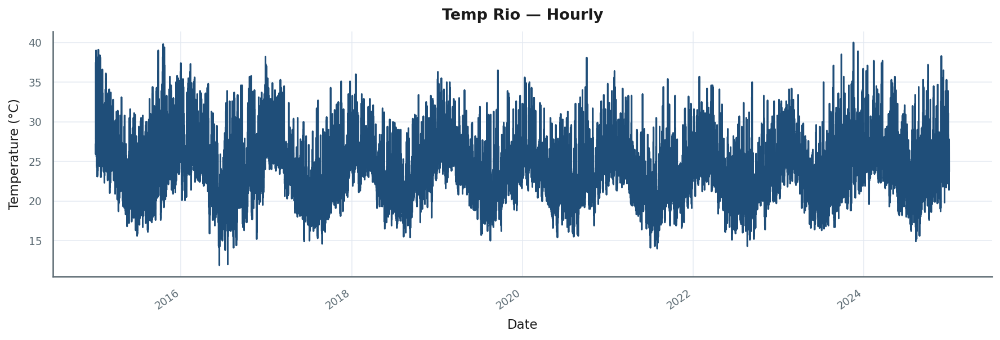

```python
# [PLACEHOLDER]
from read_timeseries_csv import load_series_from_csv
from seasonality_graphs import plot_time_series

hourly = load_series_from_csv("data/temperature_rio_hourly.csv", "datetime", "temperature_2m_c")
plot_time_series(hourly, title="...", ylabel="Temperature (°C)")
```

`[INSIGHT: …]`  
`[CAVEAT: …]`  
`[TRANSIÇÃO: …]` — ex.: “Se a série parece viável, reduzimos o ruído agregando no tempo.”

### 4.2 Série diária — Fig. 02

| | |
|-|-|
| **Perguntas** | O **ciclo anual** fica mais legível após agregar para o dia? A **amplitude sazonal** (verão–inverno) é da ordem de quantos °C? Há anos **mais quentes/frios** que outros (H1, H8)? |
| **Hipóteses** | H4 (ciclo anual), H1 (tendência interanual) |
| **Evidência** | `[…]` |

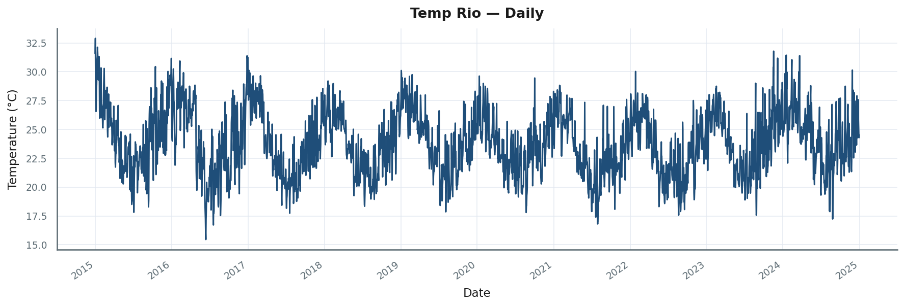

### 4.3 Série mensal — Fig. 03

| | |
|-|-|
| **Perguntas** | O **patrão mês a mês** é monotônico dentro do “ano climático” (aquecimento até verão, resfriamento até inverno)? Quantos **pontos por mês** temos (impacto em incerteza)? |
| **Hipóteses** | H4, H7 (estabilidade do ciclo quando visto grosso) |
| **Evidência** | `[…]` |

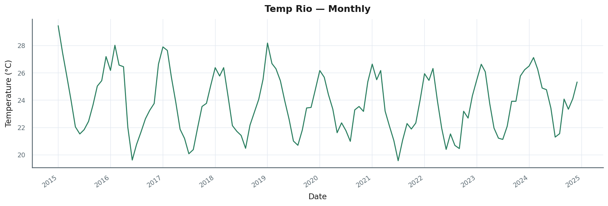

### 4.4 Três granularidades — Fig. 04

| | |
|-|-|
| **Perguntas** | Em **qual agregação** a sazonalidade aparece com melhor relação sinal/ruído (Q3)? A mesma **fenomenologia** (diária vs. anual) é visível em escalas diferentes? |
| **Hipóteses** | H2 e H4 coexistem em escalas distintas |
| **Evidência** | `[…]` |

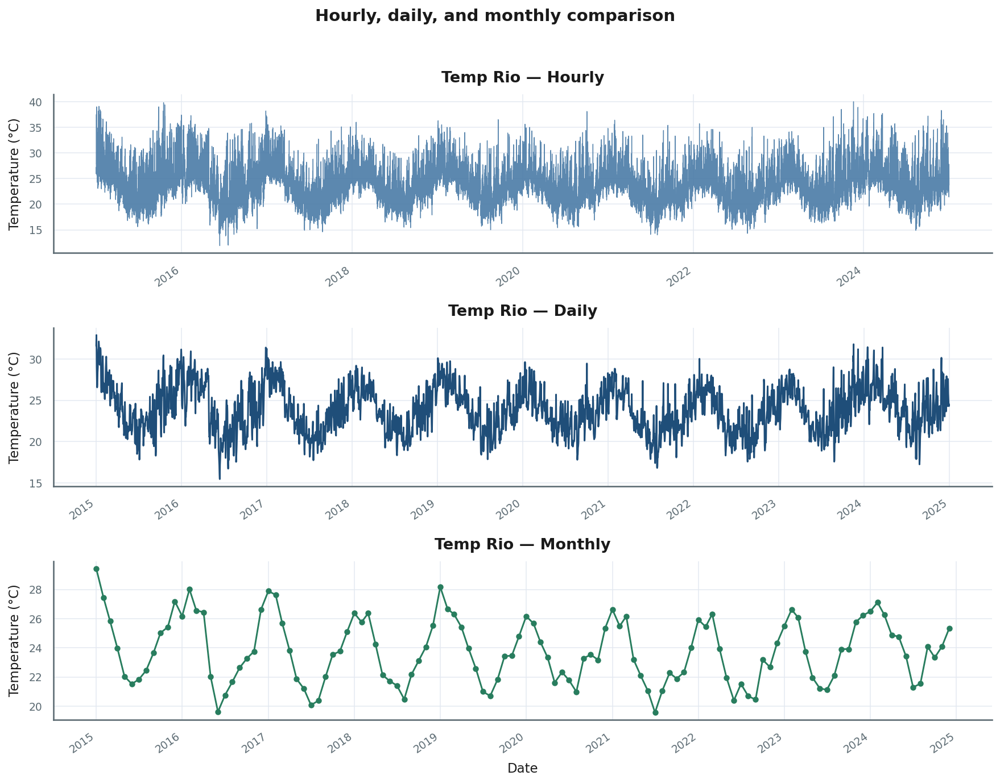

`[INSIGHT: …]`  
`[TRANSIÇÃO: …]` — ex.: “Com Q1–Q3 respondidas grosso modo, cruzamos dimensões de calendário.”

---

## 5. Etapa B — Heatmaps (médias em duas dimensões)

> **Objetivo:** localizar *quando* (hora) e *em qual contexto* (mês ou weekday) as **médias** são extremas; testar interação (Q4, H5).

### 5.1 Hora × mês — Fig. 05

| | |
|-|-|
| **Perguntas** | Em quais **células (hora, mês)** a temperatura média é máxima/mínima? O **verão** só eleva o nível ou também **muda a forma do dia** (hora do pico térmico)? Há meses em que certas horas são **mais frias que em outros meses** de forma não explicável por um fator aditivo? |
| **Hipóteses** | H4 (bandas horizontais por mês), H2 (estrutura ao longo das 24 h), H5 (interação: gradiente vertical muda de mês a mês) |
| **O que procurar** | Faixas horizontais quentes/frias (efeito mensal); “V” ou “U” ao longo das horas (efeito diário); **curvatura do perfil horário** que varia entre linhas de mês |
| **Se H5 for verdadeira** | Colunas de meses distintos têm **hora de mínimo/máximo** deslocada ou amplitude diária diferente |
| **Evidência** | `[…]` |


```python
# [PLACEHOLDER]
from seasonality_graphs import plot_heatmap_hour_month
plot_heatmap_hour_month(hourly, colorbar_label="Temperature (°C)")
```

`[INSIGHT: …]`  
`[CAVEAT: células com poucas observações podem parecer extremas; média ≠ distribuição.]`

### 5.2 Hora × dia da semana — Fig. 06

| | |
|-|-|
| **Perguntas** | Após controlar visualmente por **média horária**, ainda há diferença entre **segunda e domingo**? O efeito weekday, se existir, é **grande frente à amplitude diária** (relevância prática)? |
| **Hipóteses** | H3 (efeito weekday) — para temperatura, H₀ é plausível (sinal fraco) |
| **O que procurar** | Colunas quase paralelas (favor H₀) vs. deslocamento sistemático de uma coluna |
| **Evidência** | `[…]` |


`[TRANSIÇÃO: …]` — ex.: “Heatmaps mostram médias; testamos dispersão com boxplots.”

---

## 6. Etapa C — Distribuições por feature de calendário

> **Objetivo:** Q5 — a incerteza e os extremos também são sazonais? (H6)

### 6.1 Por hora do dia — Fig. 07

| | |
|-|-|
| **Perguntas** | A **mediana** segue o mesmo padrão da média (H2)? A **largura da caixa** (IQR) muda com a hora — madrugada mais estável que tarde? Há **outliers** em horários específicos (eventos, erros de sensor)? |
| **Hipóteses** | H2 (ordem das medianas ao longo do dia), H6 (IQR constante vs. variável) |
| **Evidência** | `[…]` |

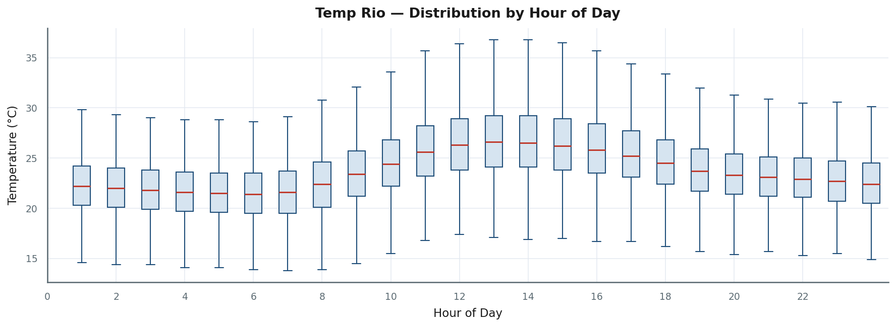

### 6.2 Por dia da semana — Fig. 08

| | |
|-|-|
| **Perguntas** | As **distribuições** se sobrepõem entre dias ou há deslocamento de mediana/IQR? O efeito é **estatisticamente crível** frente à escala °C do clima? |
| **Hipóteses** | H3, H6 |
| **Evidência** | `[…]` |

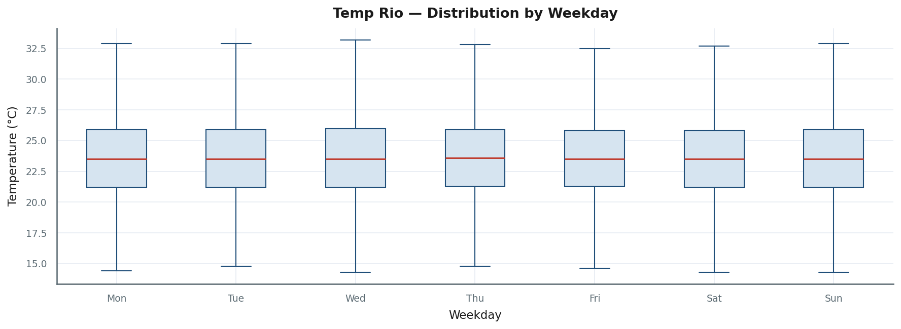

### 6.3 Por mês — Fig. 09

| | |
|-|-|
| **Perguntas** | Qual **mês** concentra valores extremos? A **variabilidade entre meses** é maior que dentro do mês (comparar IQR entre caixas)? Há **outliers sazonais** (ondas de calor em um mês específico)? |
| **Hipóteses** | H4, H6 |
| **Evidência** | `[…]` |

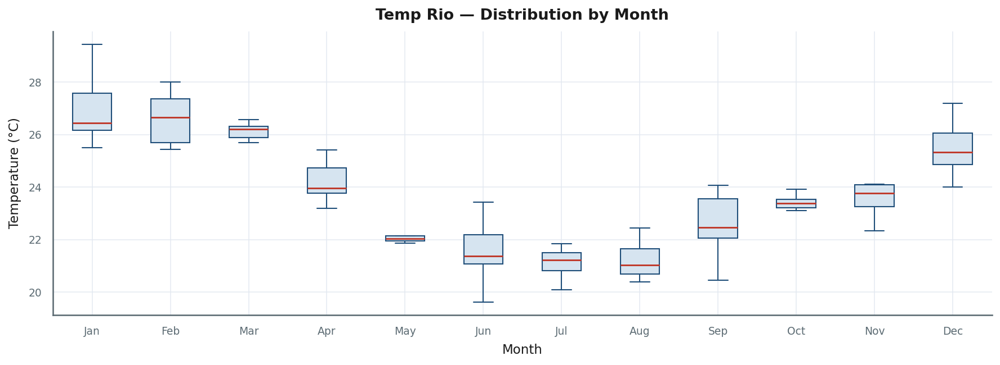

`[TRANSIÇÃO: …]` — ex.: “Marginais caracterizadas; estimamos perfis típicos e variabilidade entre cenários.”

---

## 7. Etapa D — Perfis sazonais (cenários + agregados)

> **Objetivo:** Q6 — forma típica do ciclo e **estabilidade entre cenários** (H7). Seção central do artigo.

### 7.1 Convenção visual (referência rápida)

| Camada | Significado | Pergunta que ajuda a responder |
|--------|-------------|--------------------------------|
| Nuvem azul (um cenário = um ano/dia/semana) | Realizações do ciclo | Este cenário **diverge** muito da média? |
| P10 / P90 tracejados | Envelope entre cenários | O padrão é **preciso** (envelope estreito) ou **instável** (envelope largo)? |
| Linha vermelha | Média entre cenários | Qual é o **perfil consensual** para modelar ou relatar? |

`[TEXTO: 1 frase — envelope largo = evidência visual contra H7/H8; linhas que se cruzam = possível mudança de fase.]`

### 7.2 Padrão mensal (cenário = ano) — Fig. 10

| | |
|-|-|
| **Perguntas** | Qual o **mês de pico** e de vale no ciclo anual? Os **anos concordam** na forma (H7, H8)? Algum ano é **sistematicamente mais quente** (H1)? |
| **Hipóteses** | H4, H7, H8 |
| **Evidência** | `[…]` |

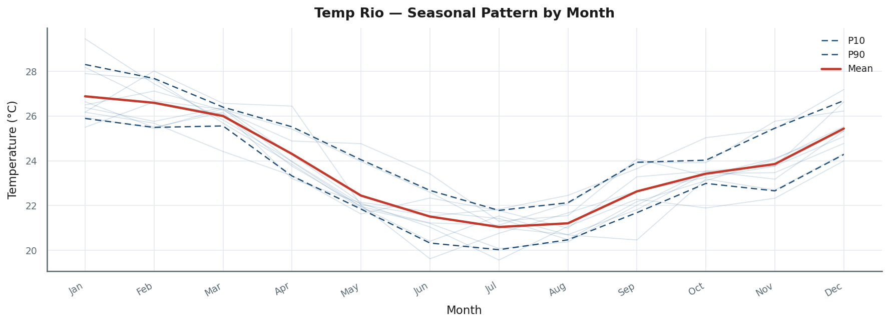

```python
# [PLACEHOLDER]
from seasonality_graphs import plot_seasonal_monthly_mean
plot_seasonal_monthly_mean(hourly, ylabel="Temperature (°C)")
```

### 7.3 Padrão intraday (cenário = dia) — Fig. 11

| | |
|-|-|
| **Perguntas** | Qual a **hora típica do mínimo** e do **máximo** diário? A amplitude **dia típico** é estável ou alguns dias têm forma atípica (frente fria, nebulosidade)? |
| **Hipóteses** | H2, H7 |
| **Evidência** | `[…]` |

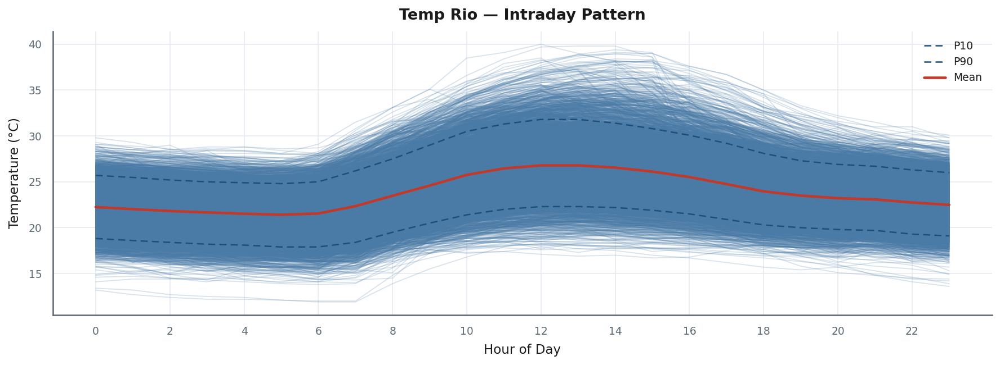

### 7.4 Padrão semanal (cenário = semana) — Fig. 12

| | |
|-|-|
| **Perguntas** | Há **dia da semana preferido** para máximos/mínimos na escala diária agregada? Semanas **se parecem** ou há semanas outlier (eventos)? |
| **Hipóteses** | H3, H7 |
| **Evidência** | `[…]` |

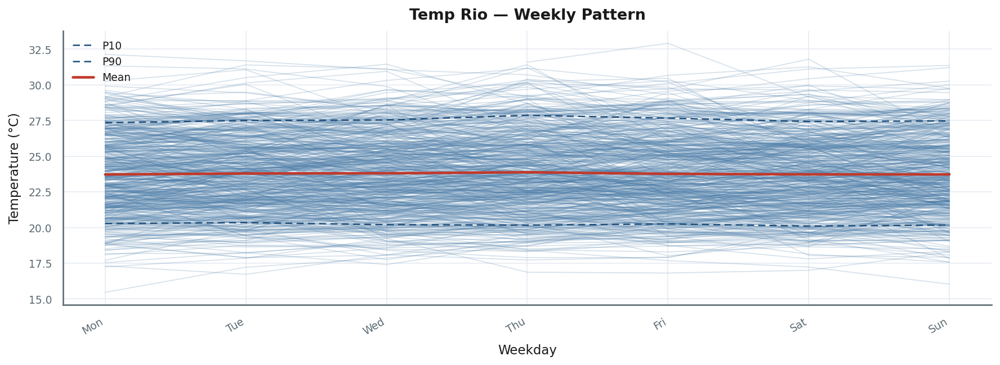

`[TRANSIÇÃO: …]` — ex.: “Perfis em calendário fixo; agora o eixo é dia-do-ano para o ciclo contínuo.”

---

## 8. Etapa E — Ciclo anual (overlay por ano)

> **Objetivo:** Q7 — alinhar fase e amplitude no eixo **dia do ano** (H8, H1).

### 8.1 Série diária (dia do ano) — Fig. 13

| | |
|-|-|
| **Perguntas** | As curvas **ano a ano se sobrepõem**? Há **deslocamento vertical** progressivo (aquecimento)? O **timing** do pico de verão/inverno é estável? |
| **Hipóteses** | H8 (coincidência), H1 (deriva), H4 |
| **O que procurar** | Linhas paralelas vs. cruzamento; verão de um ano mais quente que outro |
| **Evidência** | `[…]` |

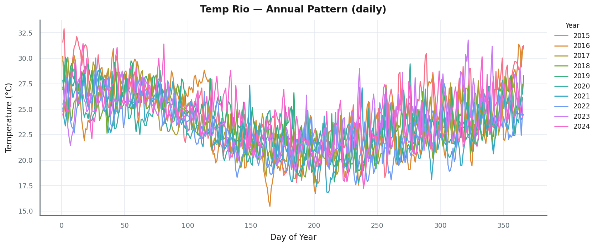

```python
# [PLACEHOLDER]
from seasonality_graphs import plot_seasonal_annual
plot_seasonal_annual(daily, ylabel="Temperature (°C)")
```

### 8.2 Série mensal (ponto por mês, por ano) — Fig. 14

| | |
|-|-|
| **Perguntas** | Com menos pontos, o **ciclo anual** ainda é robusto? Meses **outlier** aparecem em anos específicos? |
| **Hipóteses** | H4, H8 |
| **Evidência** | `[…]` |

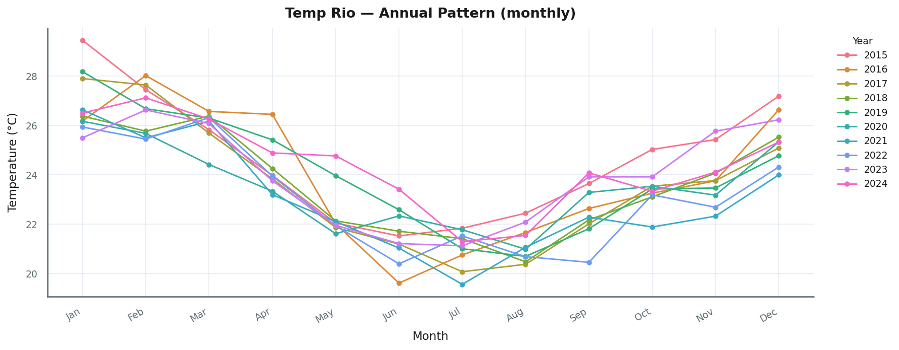

---

## 9. Etapa F — Painel multiperíodo — Fig. 15

| | |
|-|-|
| **Perguntas** | Os **três períodos dominantes** (dia, semana, ano) são **coerentes entre si**? O pico intraday **acompanha** a estação no painel anual? Onde está o **maior envelope** (maior incerteza sazonal)? |
| **Hipóteses** | Revisão integrada de H2, H4, H7 |
| **Uso** | Figura de **síntese** para discussão; não substitui leitura cuidadosa de 10–14 |
| **Evidência** | `[…]` |

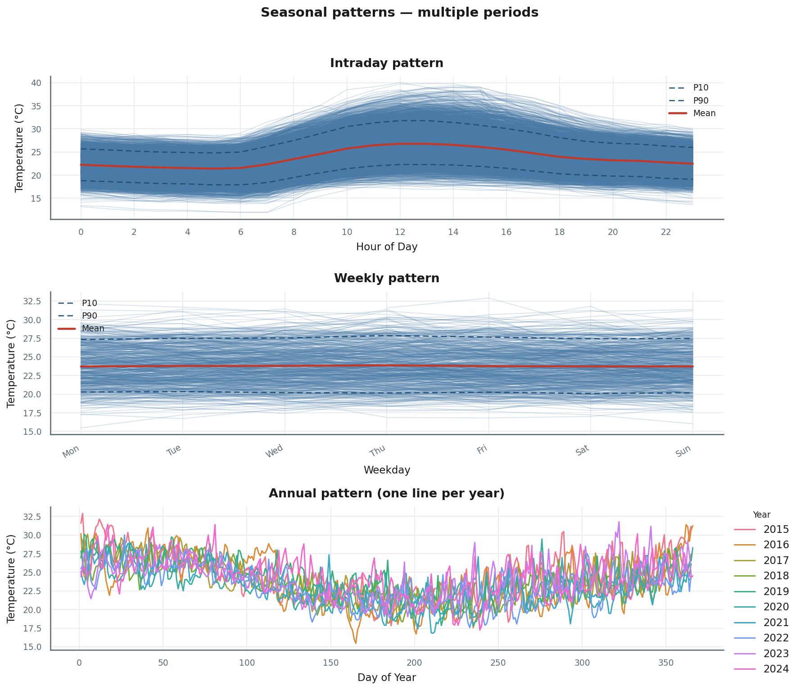

---

## 10. Etapa G — Subseries (validação condicional)

> **Objetivo:** Q8 — após **condicionar** em mês ou weekday, o que resta no tempo? (H9)

### 10.1 Subseries mensal (daily agregado por mês) — Fig. 16

| | |
|-|-|
| **Perguntas** | Dentro de cada **mês**, a série diária ainda tem **tendência** ou é aproximadamente estacionária? O padrão do perfil mensal (fig. 10) **reaparece** em cada painel? |
| **Hipóteses** | H9 (estacionariedade dentro do estrato), revisão H4 |
| **Evidência** | `[…]` |


### 10.2 Subseries mensal (série mensal nativa) — Fig. 17

| | |
|-|-|
| **Perguntas** | Com **um ponto por mês**, ainda vemos **variação intra-mês** perdida na agregação? Anos divergem **dentro do mesmo mês**? |
| **Hipóteses** | H9, H8 |
| **Evidência** | `[…]` |

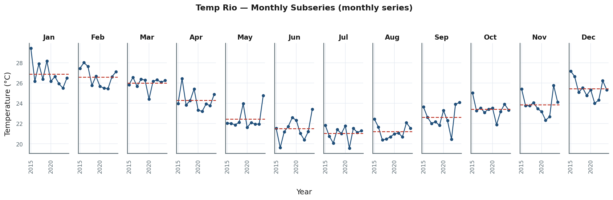

### 10.3 Subseries por weekday — Fig. 18

| | |
|-|-|
| **Perguntas** | Separando por **dia da semana**, a evolução temporal sugere efeito weekday **persistente** ou é ruído? Há **sazonalidade anual dentro de cada weekday**? |
| **Hipóteses** | H3, H9 |
| **Evidência** | `[…]` |

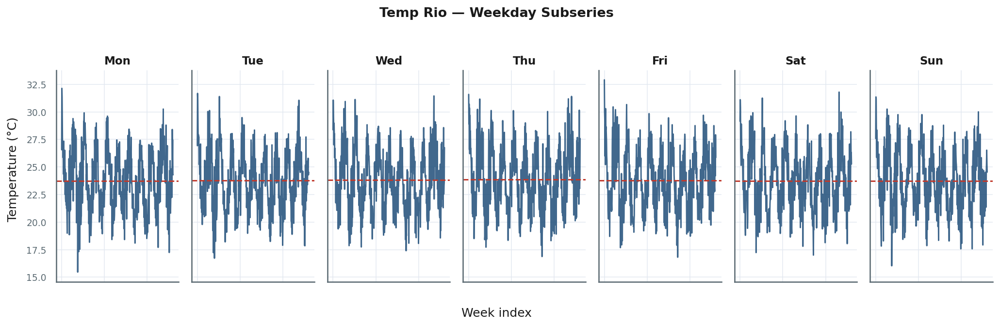

`[CAVEAT: …]` — meses com poucos pontos, anos bissextos, feriados não modelados

---

## 11. Síntese e próximos passos

### 11.1 Quadro-resumo: perguntas → figuras → conclusão provisória

| Pergunta | Figuras | Hipóteses | Conclusão visual (`[preencher]`) |
|----------|---------|-----------|----------------------------------|
| A série é viável? | 01–04 | H1 | `[…]` |
| Há ciclo intraday? | 01, 05, 07, 11 | H2 | `[…]` |
| Há efeito weekday? | 06, 08, 12, 18 | H3 | `[…]` |
| Há ciclo anual? | 02–03, 05, 09–10, 13–14 | H4 | `[…]` |
| Há interação hora × mês? | 05 | H5 | `[…]` |
| A dispersão é sazonal? | 07–09 | H6 | `[…]` |
| Perfis são estáveis entre cenários? | 10–12, 15 | H7 | `[…]` |
| Anos coincidem no ciclo anual? | 10, 13–14 | H8 | `[…]` |
| Comportamento dentro do estrato? | 16–18 | H9 | `[…]` |

### 11.2 Redação científica da conclusão (template)

`[PARÁGRAFO: Em temperatura horária no Rio ([período]), observamos evidência visual [forte/moderada/fraca] para ciclos [diário/anual] (figs. …). A interação hora×mês [não foi / foi] sugerida pelo heatmap (fig. 05). O efeito weekday [permaneceu / não se destacou] frente à variabilidade climática (figs. 06, 08). A estabilidade interanual [foi alta/baixa] (envelope nas figs. 10, 13). Limitações: apenas evidência exploratória; testes formais (ACF/PACF, STL, regressão harmônica) ficam para ….]`

### 11.3 Próximos passos (fora do escopo do artigo)

- Decomposição **STL / MSTL** — separar tendência, sazonalidade, resíduo  
- **ACF/PACF** em lags de calendário (24, 168, 365.25)  
- Regressão com **harmônicos** ou **splines** de calendário  
- Testes formais de **homogeneidade entre anos**  
- Outra série (`[NOME]`) com o mesmo protocolo  

### 11.4 Referências e código

`[LINK REPO]` · `[LINK NOTEBOOK OPCIONAL]` · `[CITAÇÕES DADOS / BIBLIOGRAFIA]`

---

## Apêndice A — Índice de figuras (pergunta principal por gráfico)

| # | Arquivo | Pergunta principal que o gráfico ajuda a responder |
|---|---------|------------------------------------------------------|
| 01 | `temp_rio_01_time_plot_hourly.png` | A série bruta é contínua e sugere ciclo diário? |
| 02 | `temp_rio_02_time_plot_daily.png` | O ciclo anual aparece na escala diária? |
| 03 | `temp_rio_03_time_plot_monthly.png` | O padrão térmico mês a mês é claro? |
| 04 | `temp_rio_04_time_plot_granularities.png` | Em qual agregação o sinal sazonal fica mais legível? |
| 05 | `temp_rio_05_heatmap_hour_x_month.png` | Onde estão os extremos hora×mês? Há interação? |
| 06 | `temp_rio_06_heatmap_hour_x_weekday.png` | Médias horárias diferem por dia da semana? |
| 07 | `temp_rio_07_boxplot_by_hour.png` | Mediana e dispersão variam ao longo do dia? |
| 08 | `temp_rio_08_boxplot_by_weekday.png` | Distribuições diferem por weekday? |
| 09 | `temp_rio_09_boxplot_by_month.png` | Distribuições e outliers variam por mês? |
| 10 | `temp_rio_10_seasonal_monthly_mean.png` | Qual o perfil mensal típico e sua estabilidade entre anos? |
| 11 | `temp_rio_11_seasonal_intraday.png` | Qual a forma típica do dia e a variabilidade entre dias? |
| 12 | `temp_rio_12_seasonal_weekly.png` | O perfil semanal típico é estável entre semanas? |
| 13 | `temp_rio_13_seasonal_annual_daily.png` | Os anos se alinham no ciclo dia-do-ano? |
| 14 | `temp_rio_14_seasonal_annual_monthly.png` | O ciclo anual é robusto na escala mensal? |
| 15 | `temp_rio_15_seasonal_multiperiod_panel.png` | Os ciclos diário, semanal e anual são coerentes? |
| 16 | `temp_rio_16_subseries_monthly_daily.png` | Dentro de cada mês, o que resta na série diária? |
| 17 | `temp_rio_17_subseries_monthly_native.png` | Dentro de cada mês (nativo), há deriva entre anos? |
| 18 | `temp_rio_18_subseries_weekday.png` | Separado por weekday, há estrutura residual? |

---

## Apêndice B — Notas de redação (não publicar)

- Cada seção 4.x–10.x deve seguir o **ritmo**: Perguntas → Hipóteses → Figura → Evidência → Insight → Caveat → Transição.  
- `[INSIGHT]` = interpretação em 1–3 frases, preferencialmente referenciando H# aceita/rejeitada *visualmente*.  
- `[CAVEAT]` = limitação (média vs. distribuição, poucos pontos, causalidade).  
- `[TRANSIÇÃO]` = ligação lógica à próxima pergunta do roteiro.  
- Ordem 4→10 é obrigatória para narrativa científica; não antecipar perfis (10–12) antes de viabilidade (01–04).  
- Tom: primeira pessoa do plural ou impessoal (“observamos”, “o gráfico sugere”), evitar certeza absoluta sem teste formal.
