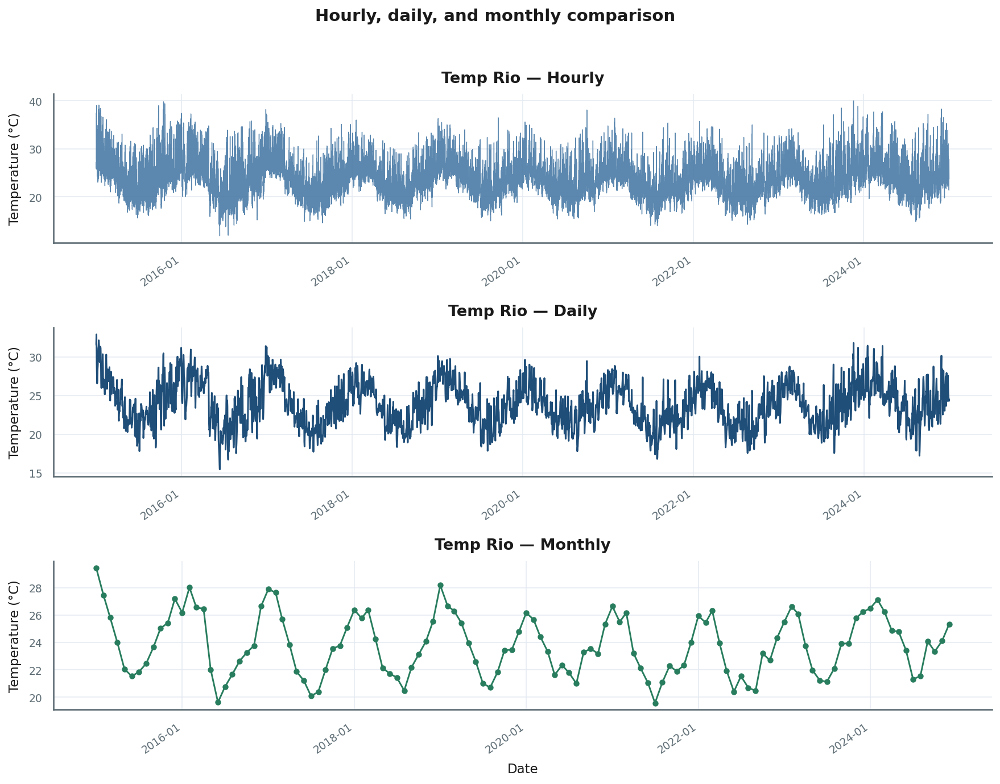
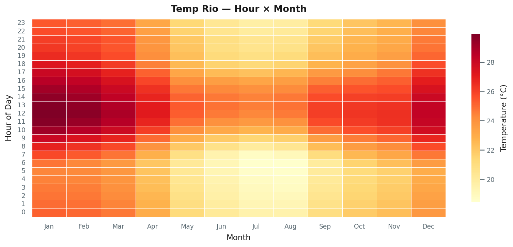
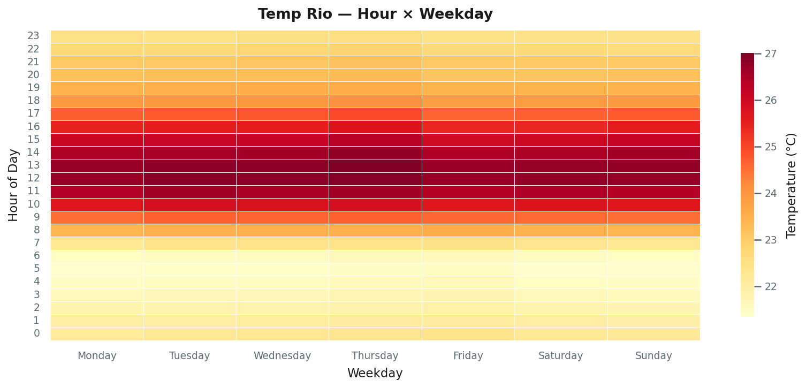
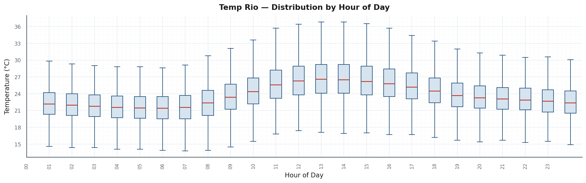
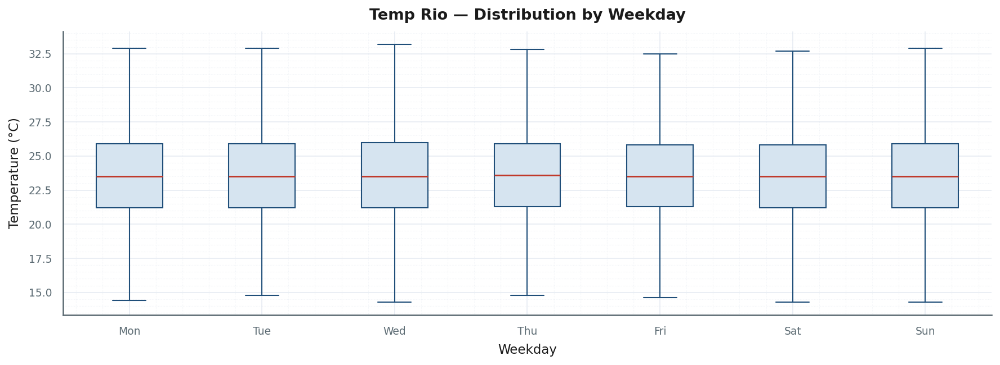
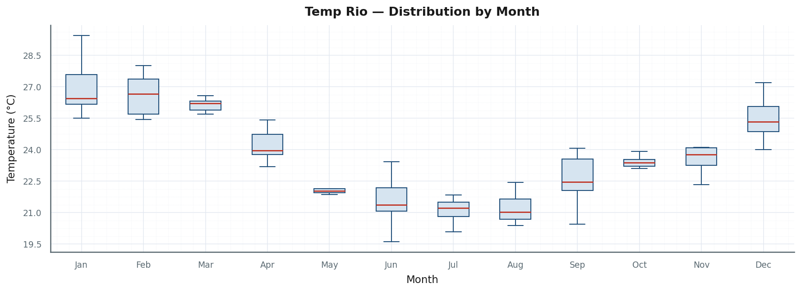
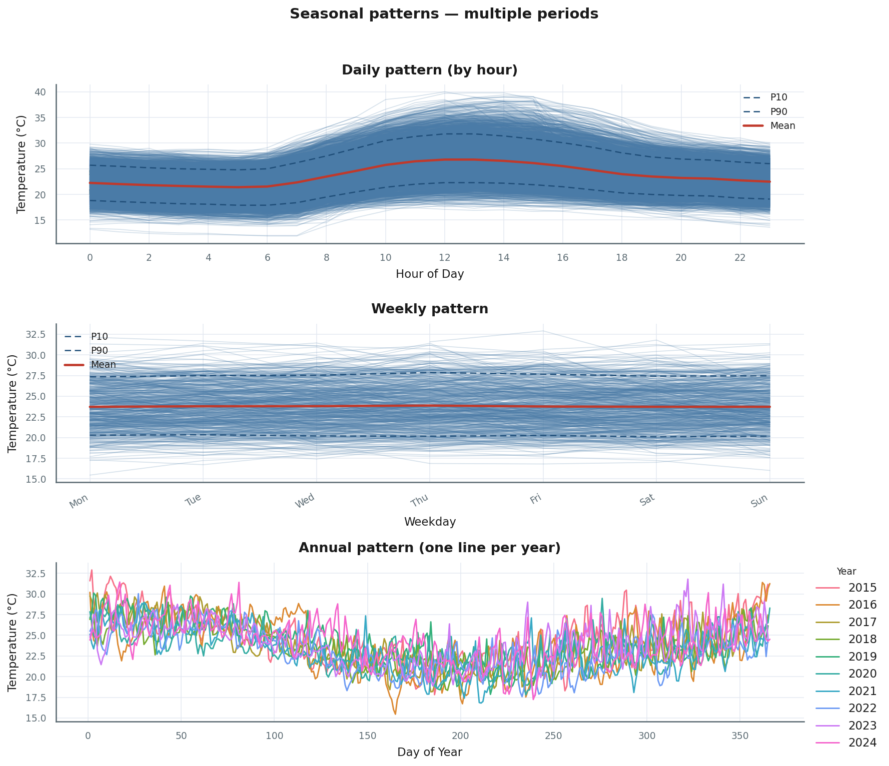
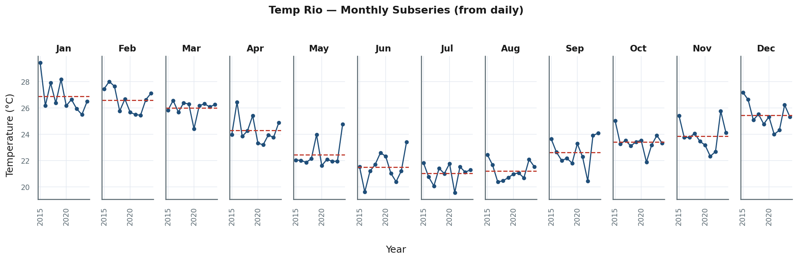

# Seeing Before Modelling: A Visual Guide to Multiple Seasonalities in Time Series EDA

*Using ten years of Rio de Janeiro temperatures to hunt for daily, weekly, and annual patterns — one chart at a time.*

---

## Introduction

There's a temptation in time series analysis to jump straight to decomposition, modelling, and forecasting. I've done it. The problem is that if you skip the exploratory work — or rush it with a single time-series plot at one resolution — you can easily miss entire seasonal structures hiding in plain sight. As my first time series professor, Cris, once put it: for seasonal series, get the seasonal structure right and even the most naive model can surprise you.

This article is a visual walkthrough of that exploration. We use ten years of 2 m air temperature in Rio de Janeiro (2015–2024, Open-Meteo ERA5 — [Historical Weather API docs](https://open-meteo.com/en/docs/historical-weather-api)) as a running example. Rio is instructive: the physics are clean, the signal is strong, and we have the same variable at three granularities — hourly, daily, and monthly — which means we can go looking for **daily**, **weekly**, and **annual** seasonality with the right tools for each.

The goal is not a gallery of charts. Each figure is a different way of asking the same few questions: does temperature repeat **within the day** (across hours), **within the week** (across weekdays), and **within the year** (across months and seasons)? We stay visual throughout; formal tests and models come later.

---

## Multiple Seasonalities: A Quick Framing

First things first, **what is seasonality?** Let me give you two answers — one intuitive, one more precise. 

Intuitively, seasonality is just a pattern that repeats on a predictable calendar rhythm: hotter summers, quieter Sundays, busier Decembers. More precisely, a time series is seasonal when it exhibits periodic fluctuations with a fixed and known period $m$ — the number of observations in one full repetition of the pattern. Both definitions point to the same idea: structure you can anticipate, if you know where to look. It is important to say that periodic pattern does not mean a deterministic pattern. The seasonal component itself can, and commonly is, stochastic - aka random - but the period $m$ must be fixed.

In *Forecasting: Principles and Practice* (3rd ed.), Hyndman and Athanasopoulos describe **multiple seasonal patterns** as the presence of more than one repeating seasonal structure in the same series — and they note it is routine in high-frequency data. Their electricity-demand example from Australia shows all three at once: lower use overnight, different weekday vs. weekend behaviour, and higher demand in summer and winter. Surface temperature in Rio is a different variable, but the logic is the same. We should look for **daily**, **weekly**, and **annual** seasonality, and we should expect some to be strong and others simply absent.

One naming point matters before we go further. In FPP's sense, **daily seasonality** does *not* mean "the whole series wiggles every calendar day in the long-run plot." It means the pattern **across hours within a day** — cool before sunrise, warm in early afternoon — that repeats day after day. That is the profile you can only see clearly when you work with hourly data or hour-of-day summaries.

The **seasonal period** *m* counts how many observations fit in one full repeat of a pattern. Crucially, *m* depends on the granularity of the series — we are not changing the physics when we switch between CSVs, only changing how many data points fall inside one seasonal period:

| Seasonality | What repeats | *m* if the series is… |
|-------------|--------------|---------------------------|
| **Daily** | Pattern across hours within a day | Hourly: *m* = 24 |
| **Weekly** | Pattern across days of the week | Hourly: *m* = 168 · Daily: *m* = 7 |
| **Annual** | Pattern across the year (seasons / months) | Hourly: *m* = 8766 · Daily: *m* = 365 · Monthly: *m* = 12 |

### The dataset

Three series from the same ERA5 reanalysis, all measuring `temperature_2m_c`:

| Series | Granularity | Role in this article |
|--------|-------------|----------------------|
| `temperature_rio_hourly.csv` | Hourly | Heatmaps, hour boxplots, hourly profiles |
| `temperature_rio_daily.csv` | Daily | Day-of-year overlays, weekday subseries |
| `temperature_rio_monthly.csv` | Monthly | Monthly boxplots, annual overlays |

We move from wide views of the full series toward plots that isolate each seasonal scale. Heatmaps show **means** across two calendar dimensions; boxplots add **spread** by hour, weekday, and month; profile plots show the typical seasonal shape and how much it varies from year to year or day to day.

---

## Setup and Reproducibility

All the code and data download scripts live in the companion repository on GitHub: [SeasonalityGraphs project folder](https://github.com/MathNog/MathNogMediumArticles/tree/main/TimeSeriesEDA/SeasonalityGraphs). The README walks you through the environment setup, how to fetch the Open-Meteo ERA5 data, and how to regenerate all 18 figures in one command.

---

## First Look: Three Resolutions

The natural starting point is to plot the entire series at three granularities — hourly on top, daily in the middle, monthly at the bottom.

**Figure 1.** The same ten years at three levels of aggregation. The hourly panel is dense and almost unreadable; the daily panel shows ten clean warm-cool swings; the monthly panel is a smooth seasonal skeleton.

**Annual seasonality** jumps out immediately. On the daily series (*m* = 365), you can count ten warm–cool swings — austral summers (December–February) high, June–August low. The monthly series (*m* = 12) strips almost everything else away and leaves that annual rhythm alone. You can see that even though the repetition is clear, the seasonal pattern is not deterministic; it is stochastic. This means that every summer is warmer then every winter, but how much warmer changes over the years.

**Daily seasonality** (*m* = 24, hourly data only) does **not** show up here. The top panel looks like textured noise at this zoom; you cannot read the hour-of-day profile from a decade-long hourly trace. That is the main lesson of Fig. 01: a single time-series plot at full length is well-tuned for **annual** structure, and poorly suited for everything else. To investigate **daily** seasonality you need plots that explicitly aggregate by hour — heatmaps, boxplots by hour, and hourly profiles. Let's build those next.

---

## Two Calendar Dimensions at Once

A line plot shows *when* temperature moves. A heatmap shows **two** calendar axes simultaneously: the mean temperature in each cell. On hourly data, that is where **annual** and **daily** seasonality appear side by side — and where you start to notice that their interaction is not trivial.

### Hour × Month — Fig. 02

**Figure 2.** Hottest cells: late morning to early afternoon (hours 11-14) in Jan-Feb and Dec. Coolest: pre-dawn hours in July and August. Read horizontally for annual seasonality; read vertically for the daily cycle.

Read along a horizontal band at a fixed hour: temperature rises and falls with the month — **annual seasonality** on hourly data (here collapsed to month-of-year for readability). Read up a column at a fixed month: cool before sunrise, peak around noon–2 pm, cooler in the evening — **daily seasonality** (*m* = 24).

Now compare January and July. In January, the gap between the 6 am row and the noon row is large; in July, it is noticeably smaller. The **shape of the daily cycle** is not the same in every month — hour and month interact in a way that a simple additive decomposition will not capture perfectly. Worth keeping in mind when you move to modelling.

### Hour × Weekday — Fig. 03

**Figure 3.** Seven parallel columns showing the same daily profile every day of the week. There is nothing to find here, and that is already informative.

We include **weekly seasonality** (*m* = 168 on hourly data) for completeness, but the answer is essentially foregone: there is no physical reason Sunday should be systematically warmer than Wednesday. The atmosphere does not follow the calendar week. The heatmap matches that expectation — all seven columns show the same gradient from cool pre-dawn to warm midday. Nothing shifts from Monday to Sunday. **Weekly seasonality is absent**, and we will see the same flat story repeated in every subsequent plot that touches weekdays.

---

## Seasonal Levels and Spread by Calendar Feature

Heatmaps show **means** only. A warm average at noon could mean every day is consistently warm at noon, or it could hide a mix of very hot and mild days. Boxplots let us read both the typical **level** (median) and the **spread** (IQR, whiskers) by calendar category — the same three seasonal questions, now with an extra layer of information about variability.

### By Hour of Day — Fig. 04

**Figure 4.** Medians rise from ~22 C in the early hours to 26-27 C at midday, then fall. Midday boxes are also visibly wider, so afternoons are hotter and more variable.

**Daily seasonality** is strong and easy to read. Early-morning hours (2–6 am) have tight boxes — consistently cool. Midday hours (11–15) have wider IQRs and longer upper whiskers — not only warmer on average, but more variable from day to day. The spread is itself a feature of the daily cycle, not just the level. Remenber that those boxplots are showing the hourly distribution of the full years. One interesting extra step could be to divide this plot into 4 seasons to answer the question: does the daily variability changes across seasons? Perhaps during the summer the days are consistenly warmer. Perhaps winter temperatures changes a lot during the day.

### By Weekday — Fig. 05

**Figure 5.** Seven nearly identical boxes. No weekday effect.

The expected null: **no weekly seasonality**. All seven days sit on top of each other. A weekday dummy in a temperature model would add nothing.

### By Calendar Month — Fig. 06

**Figure 6.** Jan-Feb highest (~26-27 C median); Jul-Aug lowest (~21 C). A ~5-6 C swing from summer peak to winter trough, with wider boxes in summer.

The median steps smoothly through the year — classic southern-hemisphere **annual** pattern. Summer months have wider IQRs than mid-winter; Rio is not only hotter in summer but also more variable day to day. Winter months (especially July–August) are narrower and more predictable. That asymmetry in spread matters: it shows up later in the profile plots too.

---

## Typical Seasonal Profiles

Now we plot the **average seasonal shape** for each scale and overlay many realisations — one line per year, or per day — along with a P10–P90 envelope and a red mean line.

| Layer | Meaning |
|-------|---------|
| Light blue lines | Individual years (or days) |
| Dashed P10/P90 | Spread across those realisations |
| Solid red | Overall mean profile |

A wide envelope means the seasonal pattern is stable in *shape* but not in *level* from one year or day to the next.

### Annual Profile by Month — Fig. 07

**Figure 7.** Ten lines (one per year): warm Jan-Feb, trough in July, recovery toward December. The bundle is tight in winter and slightly wider at the summer peak.

Built from hourly data aggregated to mean temperature by calendar month. This is a clean picture of **annual seasonality** — *m* = 12 at monthly resolution. The ten years are nearly parallel: same timing, similar amplitude. The summer peak is where years diverge most, consistent with the boxplot in Fig. 06. Notice that the spread of the P10-P90 interval follows perfectly the spread of the boxplots in the previous figure (look at March and October for a clear comparison).

### Daily, Weekly, and Annual Profiles — Fig. 08

**Figure 8.** Three panels side by side: the daily pattern (strong), the weekly pattern (flat), and the annual pattern on daily data (ten overlapping years).

**Top panel — daily seasonality (*m* = 24):** Mean temperature rises from ~22°C pre-dawn to ~26–27°C between 11 am and 2 pm, then falls. The envelope is tight at 6 am and fans out by noon (nearly 15°C between P10 and P90) — many days share the same *timing* of the peak even when they disagree on how hot the afternoon gets.

**Middle panel — weekly seasonality:** The mean is a flat line. The envelope is two horizontal bands. No day of the week stands out. This panel is the formal version of what we already called obvious.

**Bottom panel — annual seasonality (*m* = 365 on daily data):** Ten years on the day-of-year axis follow the same broad arc — hot at the year edges (austral summer), cool around days 190–210 (winter) — but they cross more than the monthly profile in Fig. 07 does, because daily values carry more within-year weather noise. Year-to-year differences become hard to separate from day-to-day variability; still, every year follows the same gross shape. Some years run hotter or cooler in particular summers or winters, but the seasonal clock stays put. If you wish to explore long term patterns, such as temperature changes over the year, maybe a high frequency data is not ideal, since it may introduce "noise" from other high frequency patterns.

---

## Does the Annual Pattern Repeat Across Years?

The bottom panel of Fig. 08 already shows the annual structure on daily data. Here we zoom in with a cleaner view — one point per month, one line per year — to get a sharper picture of year-to-year consistency.

### Monthly Resolution — Fig. 09

**Figure 9.** Ten years, one point per month. Same V-shape every year; summers spread more, winters cluster tightly.

With monthly aggregation (*m* = 12), the picture is clean. All ten years follow the same **annual** rhythm. Winters cluster closely; Jan–Feb separate more across years (~4°C between the warmest and coolest in this window). The divergence is mainly in **amplitude** at the summer peak — not in *when* the trough arrives. July or early August stays the coldest slice across all years.

---

## Zooming Inside Calendar Strata

Subseries plots fix one calendar bucket — a month, or a weekday — and show the series through time inside that stratum. They answer a natural follow-up question: once we know the global **annual** or **weekly** structure, what does a single slice actually look like up close?

### Twelve Months — Fig. 10

**Figure 10.** One panel per month: daily values from 2015-2024 with the cross-year mean as a red dashed line. January is clearly warmer than July.

Each panel is a slice of **annual seasonality**: January's mean sits well above July's. Within a given month, points scatter around the dashed mean without a clear decade-long slope in most panels — but January and other summer months span a noticeable range between years. In this daily-based view, that spread is already clear: the summer months are visibly wider year to year than winter, and January varies by roughly 4°C across the 2015-2024 window. Modelling "January in Rio" as a fixed seasonal level plus noise would miss real interannual movement in the warm season.

### Seven Weekdays — Fig. 11

**Figure 11.** Seven panels of daily averages by weekday, with identical red means and the same annual ups and downs in every panel.

The clearest restatement of the obvious: Monday, Wednesday, and Saturday share the same mean level and the same decade of **annual** ups and downs. **Weekly seasonality** has nothing to add here. Calendar weekday dummies would be dead weight for this variable.

---

## What We Learned

Rio's 2 m temperature from 2015–2024 is a clean example of **multiple seasonalities** with very unequal strength.

**Annual seasonality** dominates the narrative whenever we step back from hourly noise — roughly 5–6°C from the winter median to the summer median, stable in *timing* across years but with meaningful spread in hot months (up to ~4°C between years in Jan–Feb). On daily data *m* = 365; on monthly data *m* = 12.

**Daily seasonality** is equally real but **invisible on a long hourly plot** (Fig. 01). It appears once we aggregate by hour: a ~4–5°C swing from pre-dawn to afternoon in the mean profile, with a wider envelope at midday and a larger daily amplitude in summer than in winter (Figs. 02, 04, 08). On hourly data *m* = 24.

**Weekly seasonality** is absent — as physics would predict. Heatmaps, boxplots, profiles, and subseries all tell the same flat story. A *m* = 168 or *m* = 7 term would not earn a place in a model here.

Spread matters too: afternoons and summer months are more variable, not just warmer. Hour and month interact slightly in the daily shape (Fig. 02). None of this replaces formal inference, but it narrows what a forecaster should plan for: at least **daily** and **annual** seasonal structure on hourly data, no **weekly** term, and interannual variation in summer levels that is worth modelling explicitly.

> Investigating multiple seasonalities takes multiple visualization techniques. A plain time-series plot of the full series is the one view most likely to hide high-frequency structure — and the visual noise in dense hourly data can make us overlook daily or weekly patterns altogether.

### Next steps

This article stays exploratory and graphical. Natural follow-ups — aligned with FPP3 Chapter 12 on complex seasonality — include:

- **MSTL / multiple-seasonal decomposition** on hourly data to separate daily and annual components simultaneously
- **ACF at seasonal lags** — 24, 168, and 8766 for hourly series; 7 and 365 for daily
- **Dynamic harmonic regression** (Fourier terms) or **TBATS** for multiple seasonal periods
- Implementation in R (`fable`, `tsibble`) or Python, depending on your stack

The next piece in this series moves from "we can see the structure" to "we can estimate and forecast it."

Code and data: [SeasonalityGraphs project folder](https://github.com/MathNog/MathNogMediumArticles/tree/main/TimeSeriesEDA/SeasonalityGraphs) · Data: Open-Meteo ERA5 — [Historical Weather API docs](https://open-meteo.com/en/docs/historical-weather-api)

---

*Thanks for reading! If you found this useful, consider following for more articles on time series analysis and forecasting.*